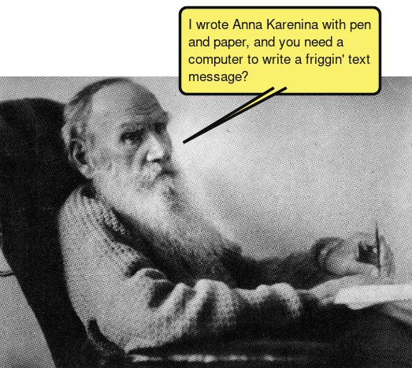

Adds speech balloons to images.

# Library dependencies

As of Debian Bookworm, install the following packages

* libmagick++-6-headers
* libjson-glib-dev
* glib-2.0 

# Compiling

`make`

# Running

1. Configure settings in `settings.json`.
2. `bin/balloon`

# Memory check

`valgrind --leak-check=full  --show-leak-kinds=all  --track-origins=yes --verbose --gen-suppressions=yes --log-file=/tmp/valgrind-out.txt  bin/balloon`

# GTK widget factory

`gtk4-widget-factory`